<a href="https://disk.yandex.ru/d/brVJGswcmuE39g">All render video</a>

Platform support:
1. Windows 10, 11
2. Windows 8, 7 (without ansi, set use_ansi 0 on 9 line)
3. Linux

2d fractal:
1. Mandelbrot
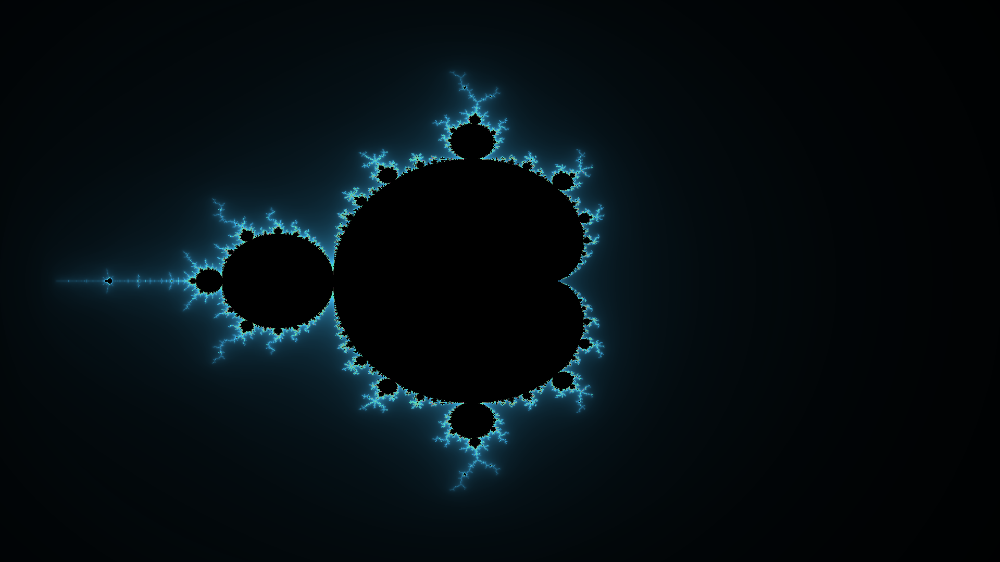
2. Tricorn
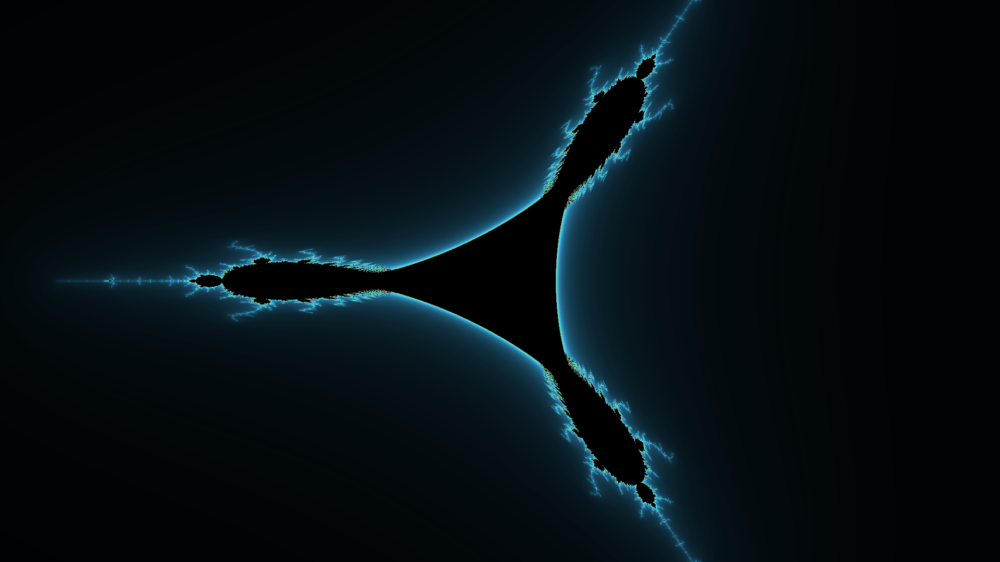
3. Burning Ship
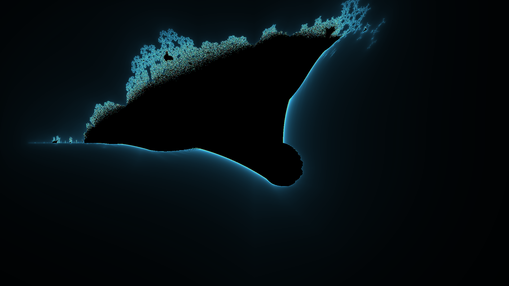
4. Collatz (z = ((7 * z + 2) - cos(pi * z) * (5 * z + 2)) / 4)
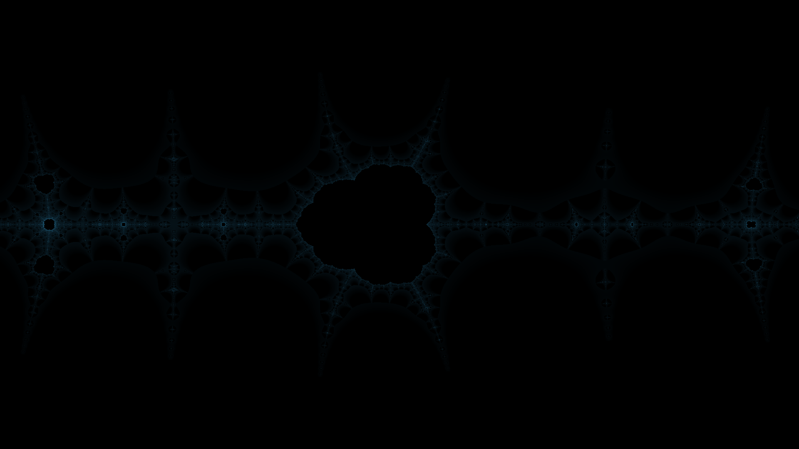
5. Collatz Mandelbrot (z = ((7 * z + 2) - exp(z) * (5 * z + 2)) / 4)
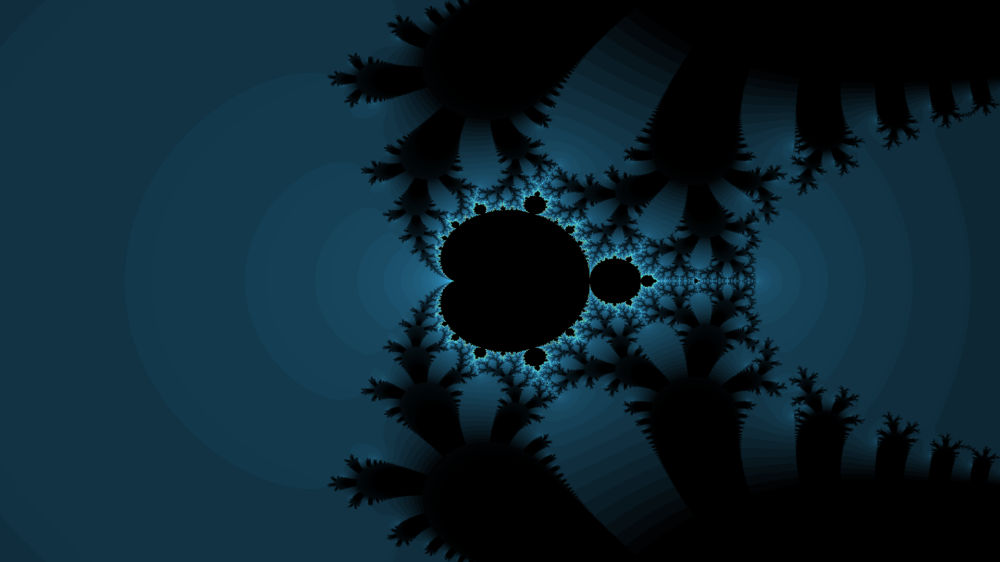
6. Collatz v2 (z = ((7 * z + 2) - exp(pi * z * i) * (5 * z + 2)) / 4)

6. z = e ^ z
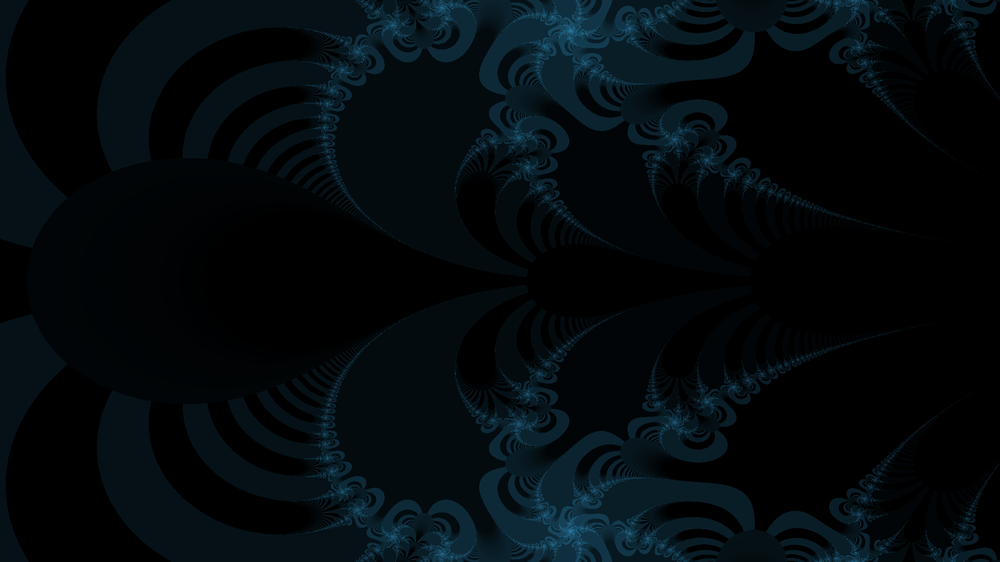
7. Phoenix
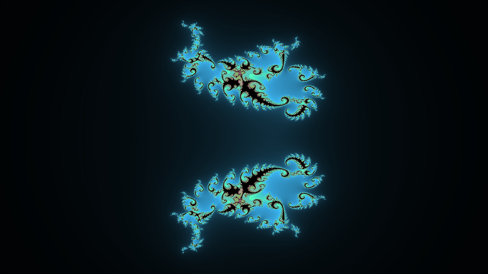
8. Feather
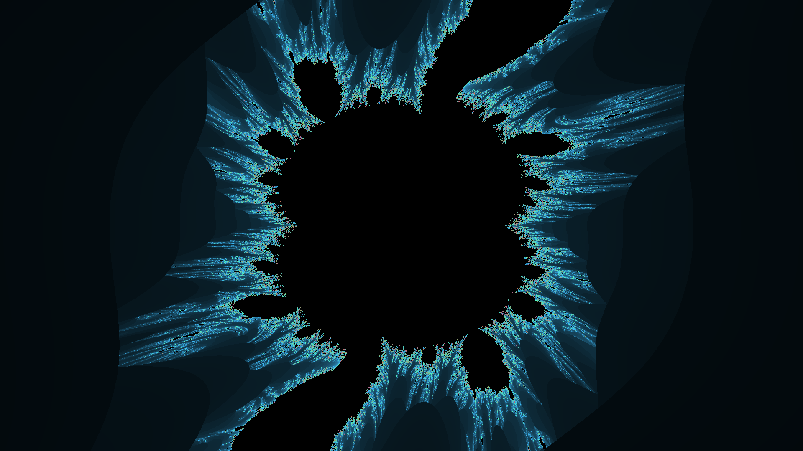
9. Newton
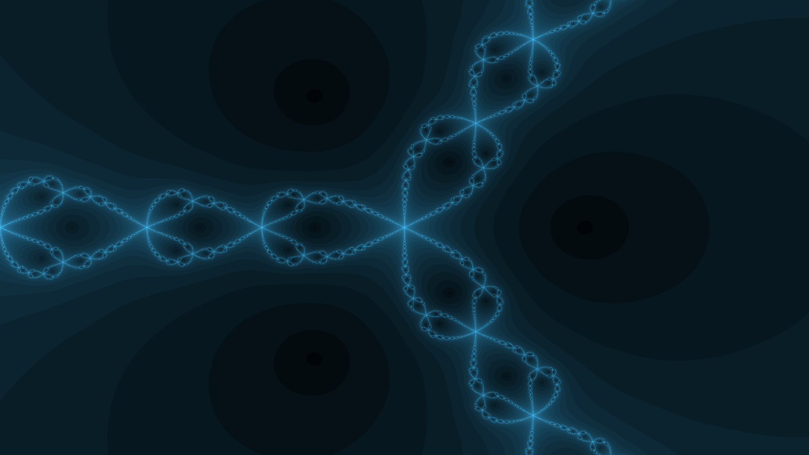
10. Lyapunov
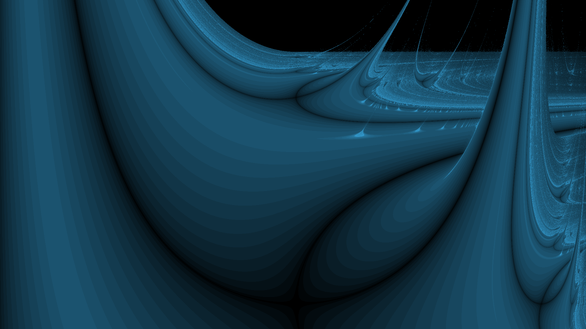

3d fractal:
1. Mandelbulb
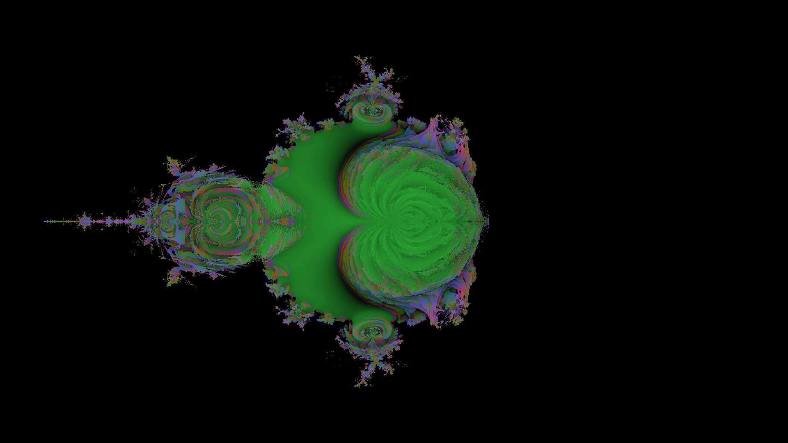

4d quaternion fractal:
1. Mandelbrot Quaternion
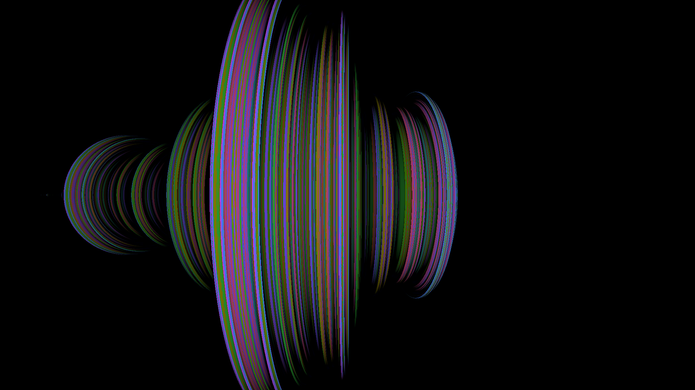

4d bicomplex fractal:
1. Mandelbrot Bicomplex
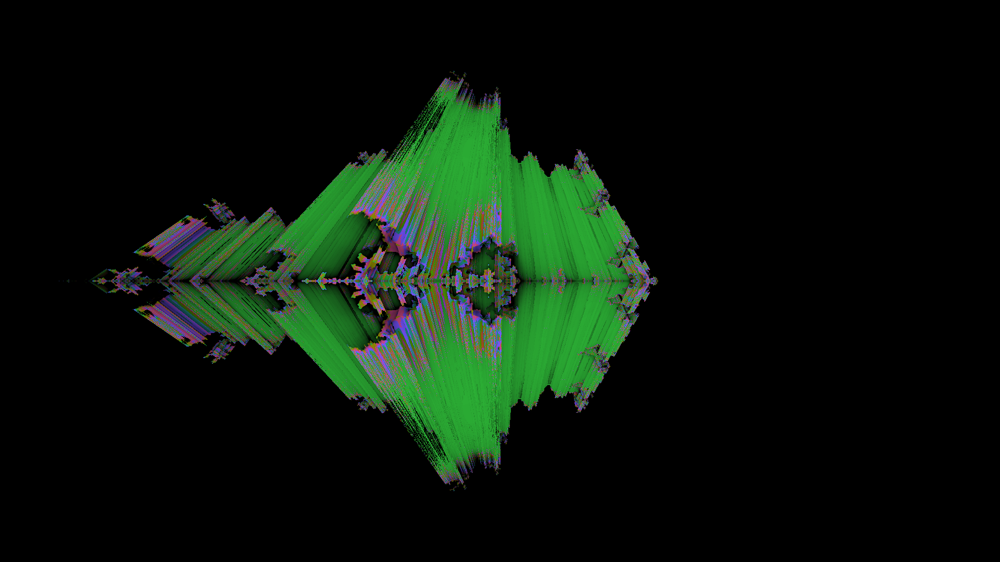

Hotkey:
1. 'V' - переключение фракталов
2. '0' - рендер fullhd (создайте рядом с исполняемым файлом папку render)
3. 'U' - переключится на julia
4. '4568' - перемещение Julia (или вращение для 3d)
5. 'WASD' - перемещение
6. 'QE' - зум
7. 'Ctrl + Scroll Mouse' - увеличить разрешение превью
8. 'N' - сменить на 3d вид
9. 'F' - деление на 1/C
10. 'RT' - сменить степень N
11. 'B' - сменить на buddha-рендеринг
12. '[]' - изменение степени
13. 'I' - переключится на 4d проекцию в bicomplex
14. 'Y' - переключится на 4d проекцию в quaternion

Для всех фракталов из примеров всегда есть Julia.

Любую формулу в математике, можно конвертировать в фрактал.

Всего существует две основные формулы фракталов:
1. z ^ 2
2. e ^ z

Основные и самые значимые это Mandelbrot, Collatz, Netwon, Lyapunov